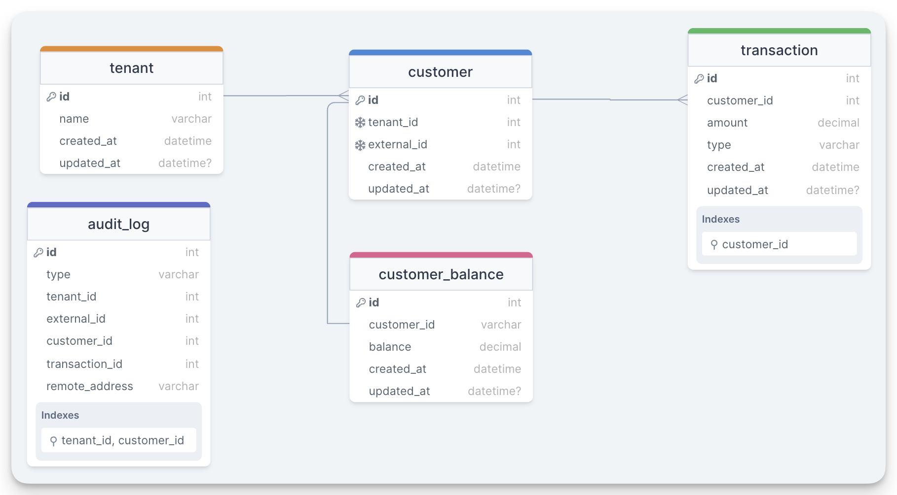

# Case Study - Enterprise All Inclusive

## Steps to run the program locally with Docker
1. clone this repository
2. from the repository folder, run:
    ```bash
    docker-compose -f docker-compose.yml up -d --build
    ```
    This should create and start a docker container for the database and one for the app itself, which should be running on port `8080`:

    
3. run `docker-compose down` when you want to stop and remove the docker containers.

## Entity Relationship Diagram
These are the entities used in the app:


Since multiple tenants might use the same customer number in their external systems, we call the customer number `external_id` on our side, and have our own internal `id` which is automatically generated. This helps us avoid issues when multiple tenants have customers with the same "customer number" on their systems and also help us avoid duplicating both `tenant_id` and `external_id` in related tables.

## API
To easily use the api, open [Postman](https://www.postman.com/downloads/) and import the included Postman collection file [postman_collection.json](postman_collection.json) to try out the endpoints.

## Seed data
Some seed data is already available for use with the app:

_Note: some columns have been omitted (e.g. "created_at", "updated_at")_

### book money
TODO: write it

### void transaction
TODO: write it  

### fetch recent transactions by tenant and customer number
TODO: write it

<details open>
  <summary><h3>tenant table</h3></summary>

| id  | name                         |
| --- | ---------------------------- |
| 1   | enterprise-all-inclusive.com |
| 2   | betrieballes-inklusive.de    |
</details>


<details open>
  <summary><h3>customer table</h3></summary>

| id  | tenant_id | external_id |
| --- | --------- | ----------- |
| 1   | 1         | 100         |
| 2   | 1         | 101         |
| 3   | 2         | 100         |
| 4   | 2         | 101         |
| 5   | 2         | 200         |
</details>


<details open>
  <summary><h3>customer_balance table</h3></summary>

| customer_id | balance |
| ----------- | ------- |
| 1           | 1000.00 |
| 2           | 700.00  |
| 3           | 2000.00 |
| 4           | 1200.00 |
| 5           | 250.00  |
</details>


<details>
  <summary><h3>transaction table</h3></summary>

| customer_id | amount  | type    |
| ----------- | ------- | ------- |
| 1           | 500.00  | PAY_IN  |
| 1           | 500.00  | PAY_IN  |
| 2           | 250.00  | PAY_IN  |
| 2           | 500.00  | PAY_IN  |
| 2           | -50.00  | PAY_OUT |
| 3           | 1000.00 | PAY_IN  |
| 3           | 1300.00 | VOIDED  |
| 3           | 200.00  | VOIDED  |
| 3           | 700.00  | PAY_IN  |
| 3           | 500.00  | PAY_IN  |
| 3           | -200.00 | PAY_OUT |
| 3           | -700.00 | VOIDED  |
| 4           | 200.00  | VOIDED  |
| 4           | 700.00  | PAY_IN  |
| 4           | 500.00  | PAY_IN  |
| 5           | 100.00  | PAY_IN  |
| 5           | 100.00  | PAY_IN  |
| 5           | 100.00  | PAY_IN  |
| 5           | 100.00  | PAY_IN  |
| 5           | 100.00  | PAY_IN  |
| 5           | 100.00  | PAY_IN  |
| 5           | 100.00  | PAY_IN  |
| 5           | -450.00 | PAY_OUT |
</details>